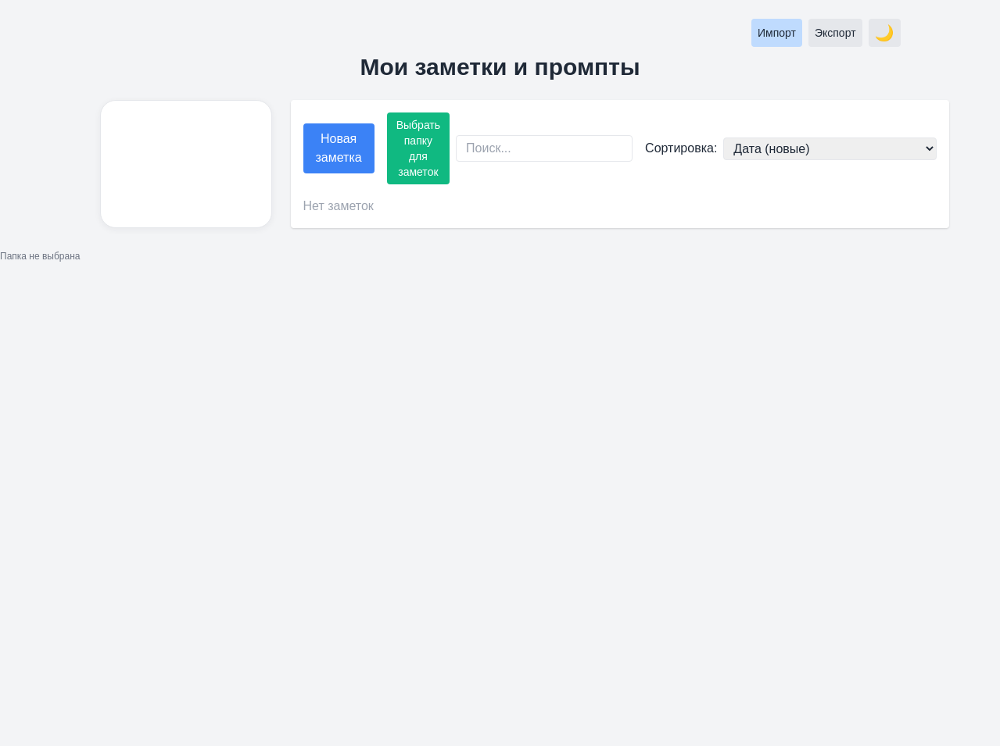
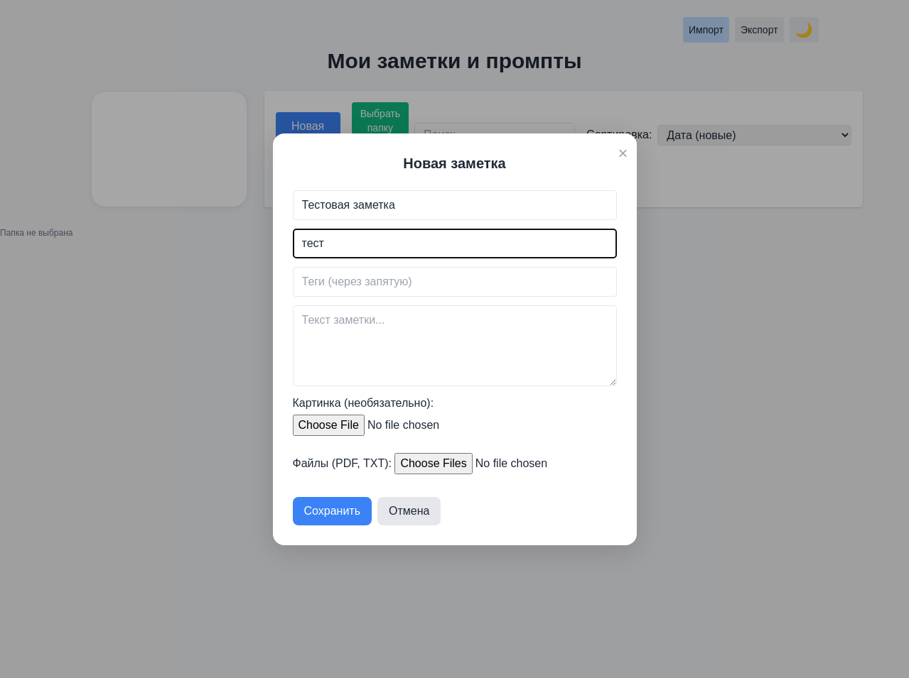

  <!-- Замените на URL вашего логотипа, если он есть, или удалите эту строку -->
  <!--  -->

  <h1>📝 Заметки: Онлайн и Офлайн / Notes: Online & Offline</h1>

  

    <strong>Простое и удобное приложение для создания и управления заметками.</strong> 
    <strong>Simple and convenient application for creating and managing notes.</strong>
  

  

    <a href="#russian-version"><strong>Русская версия</strong></a> ·
    <a href="#english-version"><strong>English Version</strong></a>
  

  

    <!-- Значки (Badges) -->
    
    <!-- Добавьте другие значки, например, лицензию, если она есть -->
    <!--  -->
    
    
    
  

---

  <a href="#english-version">Switch to English 🇬🇧</a>

## 🇷🇺 Русская версия

### 🌟 О проекте

**Заметки: Онлайн и Офлайн** — это универсальное приложение, которое поможет вам легко управлять вашими идеями, задачами и любой другой информацией. Оно доступно в двух режимах:
*   **🌍 Офлайн-версия**: Работает прямо в браузере, все данные хранятся локально на вашем устройстве. Идеально для быстрой работы без интернета.
*   **☁️ Онлайн-версия**: Клиент-серверное приложение для доступа к вашим заметкам с любого устройства через веб-интерфейс, с хранением данных на сервере.

### ✨ Ключевые возможности

*   ✍️ **Создание и управление заметками**: Легко добавляйте, просматривайте, редактируйте и удаляйте заметки.
*   🏷️ **Организация**: Используйте теги и категории для структурирования информации.
*   🖼️ **Изображения**: Прикрепляйте изображения к вашим заметкам.
*   🎨 **Темы**: Переключайтесь между светлой и темной темами для комфортной работы.
*   🔄 **Импорт и Экспорт**: Сохраняйте резервные копии (в формате JSON) или переносите данные.
*   🔍 **Поиск и Фильтрация**: Быстро находите нужные заметки.
*   📱 **Два режима**: Полностью офлайн или онлайн с серверной частью.

### 🛠️ Технологический стек

*   **Бэкенд (Онлайн-версия)**:
    *    Node.js
    *    Express.js
    *    Multer (для загрузки файлов)
*   **Фронтенд (Обе версии)**:
    *    HTML5
    *    CSS3 (включая  Tailwind CSS для офлайн-версии)
    *    JavaScript
*   **Хранение данных**:
    *   Офлайн: `localStorage` браузера.
    *   Онлайн: JSON-файлы на сервере.

### 🖼️ Скриншоты (Офлайн-версия)

  
  

### 🚀 Начало работы

#### 1. 🌍 Офлайн-версия (`notes_offline`)

1.  Перейдите в папку `notes_offline`.
2.  Откройте файл `notes-offline.html` в вашем браузере.
    *   **Важно**: Данные хранятся в `localStorage` и привязаны к браузеру. Используйте экспорт для бэкапа!

#### 2. ☁️ Онлайн-версия (`notes_online`)

1.  Убедитесь, что у вас установлен [Node.js](https://nodejs.org/).
2.  Откройте терминал в папке `notes_online`.
3.  Установите зависимости: `npm install`
4.  Запустите сервер: `npm start` (или `node server.js`)
5.  Откройте в браузере: `http://localhost:3000`

### 🗺️ Планы развития (Roadmap)

*   [ ] Улучшение безопасности `notes_online` (аутентификация).
*   [ ] Оптимизация хранения данных `notes_online` (например, SQLite).
*   [ ] Синхронизация между офлайн и онлайн версиями.
*   [ ] Расширенный редактор текста (Markdown/WYSIWYG).
*   [ ] Улучшение UI/UX.

### 🤝 Участие в разработке

Предложения и пул-реквесты приветствуются! Если у вас есть идеи по улучшению, пожалуйста, создайте Issue или Fork'ните репозиторий и сделайте свои изменения.

1.  Форкните проект.
2.  Создайте свою ветку для фичи (`git checkout -b feature/AmazingFeature`).
3.  Закоммитьте свои изменения (`git commit -m 'Add some AmazingFeature'`).
4.  Отправьте в удаленный репозиторий (`git push origin feature/AmazingFeature`).
5.  Откройте Пул-Реквест.

### 📜 Лицензия

Этот проект распространяется под лицензией MIT. Подробнее см. в файле `LICENSE`.
*(Примечание: добавьте файл LICENSE в ваш репозиторий, например, с текстом лицензии MIT).*

### 👤 Автор и Поддержка

*   **Автор**: KarpovTatts
*   **Telegram**: 
*   **Поддержать разработку**: 

---

<a href="#top">⬆️ Наверх</a>

---

  <a href="#russian-version">Переключиться на Русский 🇷🇺</a>

## 🇬🇧 English Version

### 🌟 About The Project

**Notes: Online & Offline** is a versatile application designed to help you easily manage your ideas, tasks, and any other information. It is available in two modes:
*   **🌍 Offline Version**: Runs directly in your browser, with all data stored locally on your device. Perfect for quick work without an internet connection.
*   **☁️ Online Version**: A client-server application to access your notes from any device via a web interface, with data stored on the server.

### ✨ Key Features

*   ✍️ **Create & Manage Notes**: Easily add, view, edit, and delete notes.
*   🏷️ **Organization**: Use tags and categories to structure your information.
*   🖼️ **Images**: Attach images to your notes.
*   🎨 **Themes**: Switch between light and dark themes for comfortable work.
*   🔄 **Import & Export**: Save backups (in JSON format) or transfer your data.
*   🔍 **Search & Filter**: Quickly find the notes you need.
*   📱 **Dual Mode**: Fully offline or online with a server backend.

### 🛠️ Tech Stack

*   **Backend (Online Version)**:
    *    Node.js
    *    Express.js
    *    Multer (for file uploads)
*   **Frontend (Both Versions)**:
    *    HTML5
    *    CSS3 (including  Tailwind CSS for offline version)
    *    JavaScript
*   **Data Storage**:
    *   Offline: Browser `localStorage`.
    *   Online: JSON files on the server.

### 🖼️ Screenshots (Offline Version)

  
  

### 🚀 Getting Started

#### 1. 🌍 Offline Version (`notes_offline`)

1.  Navigate to the `notes_offline` folder.
2.  Open the `notes-offline.html` file in your browser.
    *   **Important**: Data is stored in `localStorage` and is browser-specific. Use export for backups!

#### 2. ☁️ Online Version (`notes_online`)

1.  Ensure you have [Node.js](https://nodejs.org/) installed.
2.  Open your terminal in the `notes_online` folder.
3.  Install dependencies: `npm install`
4.  Start the server: `npm start` (or `node server.js`)
5.  Open in browser: `http://localhost:3000`

### 🗺️ Roadmap

*   [ ] Enhance `notes_online` security (authentication).
*   [ ] Optimize `notes_online` data storage (e.g., SQLite).
*   [ ] Synchronization between offline and online versions.
*   [ ] Advanced text editor (Markdown/WYSIWYG).
*   [ ] UI/UX improvements.

### 🤝 Contributing

Contributions are welcome! If you have ideas for improvement, please open an issue or fork the repository and make your changes.

1.  Fork the Project.
2.  Create your Feature Branch (`git checkout -b feature/AmazingFeature`).
3.  Commit your Changes (`git commit -m 'Add some AmazingFeature'`).
4.  Push to the Branch (`git push origin feature/AmazingFeature`).
5.  Open a Pull Request.

### 📜 License

Distributed under the MIT License. See `LICENSE` for more information.
*(Note: Add a LICENSE file to your repository, e.g., with the MIT License text).*

### 👤 Author & Support

*   **Author**: KarpovTatts
*   **Telegram**: 
*   **Support Development**: 

---

<a href="#top">⬆️ Back to Top</a>

---
