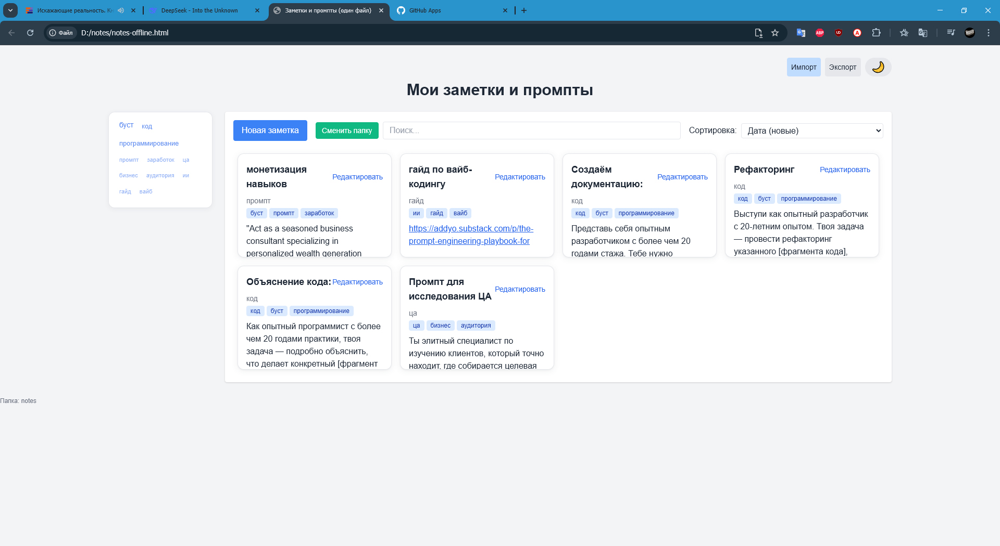

  
  
  

    <strong>Ваши заметки. Ваши файлы. Ваш компьютер.</strong>
     
    <em>Современное и безопасное приложение для заметок, работающее полностью офлайн.</em>
  

  

    
    
    
    
    
  

  

    
  

  

    
  

  

## ✨ Ключевые особенности

  <table>
    <tr>
      <td align="center">
        
         
        <strong>Полный контроль</strong>
         
        Все данные на вашем компьютере
      </td>
      <td align="center">
        
         
        <strong>Мощный редактор</strong>
         
        Поддержка Markdown
      </td>
      <td align="center">
        
         
        <strong>Вложения</strong>
         
        Изображения и файлы
      </td>
    </tr>
    <tr>
      <td align="center">
        
         
        <strong>Современный UI</strong>
         
        Светлая и темная темы
      </td>
      <td align="center">
        
         
        <strong>Умный поиск</strong>
         
        По тексту и тегам
      </td>
      <td align="center">
        
         
        <strong>Гибкая сортировка</strong>
         
        Drag-and-drop
      </td>
    </tr>
  </table>

## ⚙️ Как это работает

  

Приложение не использует серверы или облачные сервисы. Оно работает напрямую с файлами на вашем компьютере благодаря современной браузерной технологии File System Access API. Это гарантирует, что ваши данные всегда остаются с вами.

### Технологии

  
  
  
  

### Хранение данных

* 📝 Заметки: .json файлы в выбранной вами папке
* ⚙️ Настройки: IndexedDB для запоминания пути к папке
* 📂 Порядок заметок: Сохраняется в _order.json

## 🚀 Начало работы

  

1. Скачайте файл `notes-offline.html`
2. Откройте его в современном браузере (Chrome, Edge, Opera)
3. Выберите папку, где будут храниться ваши заметки
4. Готово! Наслаждайтесь полным контролем над своими данными

## 📜 Лицензия и использование

  

Этот проект распространяется по персональной лицензии.

✅ Вы можете:

* Бесплатно использовать это приложение в личных, некоммерческих целях

❌ Вы не можете:

* Распространять, продавать, модифицировать и использовать код в коммерческих проектах без письменного разрешения автора

## 🎯 Основные функции

  

* ✨ Создание и редактирование заметок
* 📝 Поддержка Markdown
* 🔍 Поиск по заметкам
* 🏷️ Фильтрация по тегам
* 📎 Прикрепление файлов
* 🌓 Темная тема
* 📤 Экспорт/импорт заметок
* ↕️ Drag-and-drop сортировка
* 📂 Работа с папками
* ⚡ Быстрый доступ к недавним папкам

## 🤝 Участие в разработке

  

Предложения и пул-реквесты приветствуются! Если у вас есть идеи по улучшению, пожалуйста, создайте Issue или Fork'ните репозиторий и сделайте свои изменения.

1. Форкните проект
2. Создайте свою ветку для фичи (`git checkout -b feature/AmazingFeature`)
3. Закоммитьте свои изменения (`git commit -m 'Add some AmazingFeature'`)
4. Отправьте в удаленный репозиторий (`git push origin feature/AmazingFeature`)
5. Откройте Пул-Реквест

## 📋 Часто задаваемые вопросы (FAQ)

  

**❓ Как это работает?**  
Приложение использует File System Access API для работы с файлами на вашем компьютере. Все заметки сохраняются как отдельные JSON-файлы в выбранной вами папке.

**❓ Безопасно ли это?**  
Да, приложение работает полностью офлайн и не отправляет данные на серверы. Все файлы хранятся локально на вашем компьютере.

**❓ Какие браузеры поддерживаются?**  
Приложение работает в современных браузерах с поддержкой File System Access API: Chrome, Edge, Opera. Firefox и Safari пока не поддерживаются.

**❓ Как перенести заметки на другой компьютер?**  
Просто скопируйте папку с заметками на другой компьютер и откройте приложение там. Все заметки и вложения будут доступны.

## 👨‍💻 Автор и поддержка

  

Автор: We1n (GitHub) | KarpovTatts (Telegram)

  

## 💰 Поддержка проекта

  

  

Если вам нравится проект, вы можете поддержать его развитие. Это мотивирует добавлять новые функции и улучшения!

## ⭐ Звезды и форки

  

Если вам понравился проект, не забудьте поставить звезду на GitHub! Это помогает проекту стать более заметным и привлечь больше пользователей.

  <a href="#top">
    
     
    Наверх
  </a>

